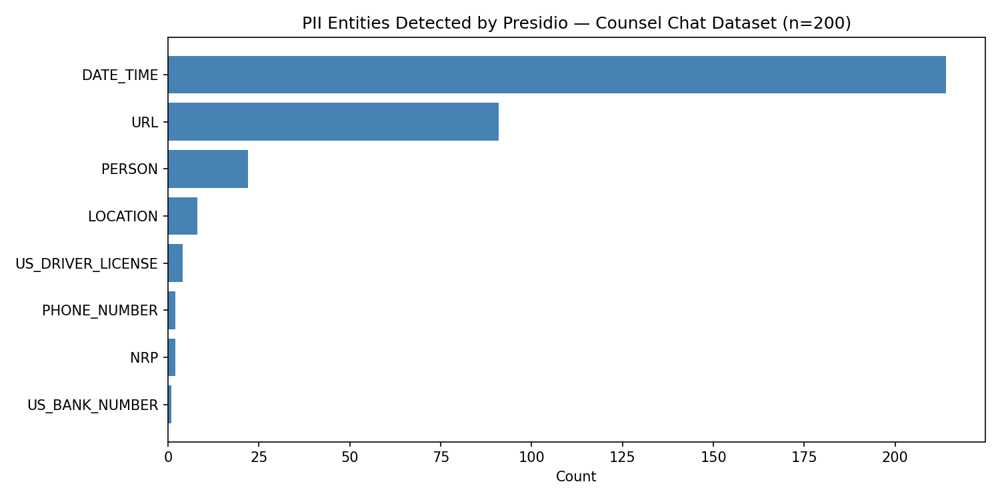

# Clinical Chat De-Identification Pipeline

A Python-based de-identification pipeline for mental health counseling text data using **Microsoft Presidio**. Built to demonstrate privacy-preserving data preparation workflows for clinical AI research.

---

## Overview

This project applies automated PII detection and removal to the [Counsel Chat dataset](https://huggingface.co/datasets/nbertagnolli/counsel-chat) — a real-world collection of 2,775 anonymized mental health Q&A exchanges between licensed counselors and individuals seeking support.

The pipeline detects and replaces sensitive identifiers including names, dates, locations, phone numbers, URLs, and more — producing a clean, de-identified dataset ready for downstream AI or LLM training and evaluation.

---

## Tools & Libraries

- **Microsoft Presidio** — PII detection and anonymization
- **spaCy (en_core_web_lg)** — NLP backbone for named entity recognition
- **pandas** — Data processing
- **matplotlib** — QC visualization
- **HuggingFace Datasets** — Dataset access

---

## Pipeline Steps

1. Load Counsel Chat dataset from HuggingFace
2. Run Presidio Analyzer to detect PII entities in each message
3. Run Presidio Anonymizer to replace entities with structured tags (`<PERSON>`, `<EMAIL>`, `<DATE>`, etc.)
4. Generate QC report with entity counts and detection rate
5. Export de-identified CSV and Markdown report

---

## PII Entity Tags

| Entity Type | Replacement Tag |
|-------------|----------------|
| PERSON | `<PERSON>` |
| EMAIL_ADDRESS | `<EMAIL>` |
| PHONE_NUMBER | `<PHONE>` |
| LOCATION | `<LOCATION>` |
| DATE_TIME | `<DATE>` |
| US_SSN | `<SSN>` |
| URL | `<URL>` |

---

## Results (n=200 sample)

- **DATE_TIME** was the most frequently detected entity, reflecting counselors referencing appointment dates and timelines
- **PERSON** names were detected across both patient questions and therapist responses
- **URL** entities reflect therapist profile links present in the raw dataset

---

## Files

| File | Description |
|------|-------------|
| `Clinical_Chat_Deidentification.ipynb` | Main notebook — full pipeline |
| `counsel_chat.csv` | Raw Counsel Chat dataset |
| `counsel_chat_deidentified.csv` | De-identified output |
| `QC_Report.md` | Markdown quality control report |
| `pii_report.png` | PII entity distribution chart |

---

## Dataset Credit

Bertagnolli, N. (2020). Counsel chat: Bootstrapping high-quality therapy data. *Towards Data Science*. [GitHub](https://github.com/nbertagnolli/counsel-chat)

---

## Author

**Arjun Barde** — MS Health Informatics & Data Science, University of Pittsburgh  
[LinkedIn](https://linkedin.com/in/arjun-barde-2224473b5) | [GitHub](https://github.com/Arjun-Barde)# Clinical_Chat_Deidentification
